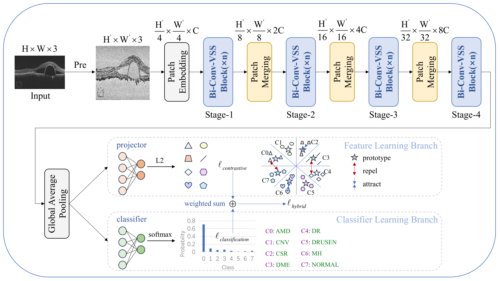

# 📄 MediTEDNet: Visual State Space Model for Thyroid Eye Disease Classification

## 📌 Overview

**MediTEDNet** is a dual-branch deep learning framework designed for accurate disease classification from medical images. It supports both **natural eye images** (for *Thyroid Eye Disease*, TED) and **OCT images** (for *retinal diseases*), using a combination of visual state space modeling and prototype-guided feature learning.

## 🖼️ Model Architecture



## 📂 Datasets

- **TED dataset**: Collected from Baoding No.1 Central Hospital (IRB: Fast [2025] No. 035)  
- **OCT datasets**:  
  - OCT-C8: [Download](https://data.mendeley.com/datasets/obulisanaren/retinal-oct-c8)  
  - OCT-2017: [Download](https://data.mendeley.com/datasets/anashibrahim/oct2017)

*Note: TED dataset is not publicly available due to privacy policies.*

## 🧠 Code

Code and training scripts are available in this repository.

## 🔧 Setup

```bash
git clone https://github.com/hanmeihui19/MediTEDNet.git
cd MediTEDNet-main
pip install -r requirements.txt
```

## 🏫 Affiliations

1. College of Mathematics and Information Sciences, Hebei University, Baoding 071002, Hebei, China  
2. Department of Endocrinology and Metabolism, Baoding No.1 Central Hospital, Baoding 071000, Hebei, China  
3. Hebei Key Laboratory of Machine Learning and Computational Intelligence, Baoding 071002, Hebei, China

## ✨ Acknowledgments
This work was supported by the Hebei Natural Science Foundation under Grant H2025201049.
